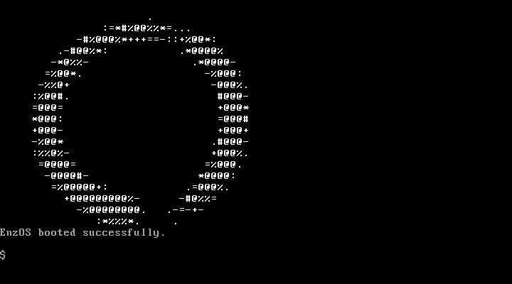

# enzos

EnzOS - tiny OS for learning purposes

## QEMU Screenshots

- 
- Integration test snapshots are uploaded by CI as artifacts and PR images so we avoid committing binary assets to the repository.
- The PR comment now includes a post-integration terminal screenshot so reviewers can see the echo command output the Go tests drive through QEMU.

The smoke screenshot comes from the same QEMU instance that continues into the integration tests. Pairing the inline smoke image with the CI-provided integration capture helps learners connect the automated checks to the on-screen behavior without bloating the repo with additional binaries.

## EnzOS — Milestone 0

“Boots, prints text, builds in CI, releases ISO”

---

1️⃣ Prepare Environment (15–20 min)

- [x] Install build tools
- [x] build-essential
- [x] grub-pc-bin and grub-common
- [x] xorriso
- [x] qemu-system-x86
- [x] Create project structure

```
enzos/
 ├── src/
 │    ├── kernel_entry.s
 │    ├── kernel.c
 │    └── drivers/
 │         ├── terminal.c
 │         └── terminal.h
 ├── linker.ld
 ├── grub/
 │    └── grub.cfg
 └── scripts/
      └── build-iso.sh

```

---

2️⃣ Implement Minimal Kernel (60–120 min)

kernel_entry.s

- [x] Add Multiboot or Multiboot2 header
- [x] Define \_start
- [x] Set up stack
- [x] Call kmain()
- [x] Halt in infinite loop

kernel.c

- [x] Implement kmain()
- [x] Initialize the terminal driver from `drivers/terminal.c` using helper APIs for color and cursor management.
- [x] Keep presentation text in one place while delegating VGA writes to the driver for clarity.
- [x] Infinite loop

linker.ld

- [x] Define ENTRY(\_start)
- [x] Place .text, .rodata, .data, .bss
- [x] Set load address (e.g. 0x100000)

---

3️⃣ Bootloader Configuration (10–15 min)

grub/grub.cfg

- [x] Set timeout to 0
- [x] Create menu entry "EnzOS"
- [x] Use multiboot2 /boot/enzos.elf (or multiboot)
- [x] Call boot

---

4️⃣ Build Script (20–40 min)

scripts/build-iso.sh

- [x] Create build/ and iso-root/ directories
- [x] Assemble kernel_entry.s → kernel_entry.o
- [x] Compile kernel.c and `drivers/terminal.c` → kernel.o and terminal.o
- [x] Link → build/enzos.elf with linker.ld
- [x] Copy enzos.elf into iso-root/boot/
- [x] Copy grub.cfg into iso-root/boot/grub/
- [x] Run grub-mkrescue -o enzos.iso iso-root/

---

5️⃣ Local Test (5–10 min)

- [ ] Boot locally in QEMU:

```
qemu-system-x86_64 -cdrom enzos.iso -serial stdio -no-reboot -no-shutdown
```

- [ ] Verify "EnzOS boot OK!" appears

## Screenshot Capture

- Integration tests automatically capture screenshots using QEMU's `screendump` command. Each PPM file (for example, `qemu-screen-smoke.ppm`) is converted to a matching PNG (`qemu-screen-smoke.png`) in the project root for easy sharing.
- Run tests locally with `./scripts/integration-test.sh` to watch the VM in a visible window, or use `--headless` for CI-like behavior.
- The CI workflow uploads PNG screenshots as artifacts and shares them in pull requests to speed up debugging.

---

6️⃣ CI Integration (30–60 min)

CI Setup

- [x] Install build dependencies in workflow
- [x] Run unit tests (if any)
- [x] Run scripts/build-iso.sh
- [x] Run integration tests with shell scenarios

Integration Tests

- [x] Run QEMU headless with monitor support
- [x] Capture VGA text output
- [x] Execute shell commands via monitor
- [x] Verify expected output
- [x] Keep each scenario's expected and unexpected shell output in the example definition (for instance, quoted arguments should not echo surrounding quotes)
- [x] Capture screenshots at key points
- [x] Exit 0 if tests pass, else exit 1

### Shell Tokenization

- The shell groups characters inside double quotes into a single argument and strips the quotes before dispatching commands, which keeps `echo "Hello, World"` aligned with typical shell behavior and our integration tests.
- If you tweak parsing rules, update both the command tokenizer and the test expectations together so learners see consistent guidance.

---

7️⃣ Release Workflow (15–30 min)

- [x] Add tag-based workflow
- [x] Build ISO
- [x] Run QEMU smoke test
- [x] Create GitHub Release
- [x] Upload enzos.iso
- [ ] Create first release tag (v0.0.1)

---

⭐ Optional Extras

- [ ] Add ASCII boot text
- [ ] Colorize VGA output
- [ ] Add serial output logging
- [ ] Add a simple GRUB theme

---

🎉 End of Milestone 0

Once all tasks are checked, EnzOS can:

- Boot via GRUB
- Run your kernel
- Print text
- Build reproducibly
- Boot automatically in CI
- Release tagged ISOs

You’re officially an OS developer 🚀
